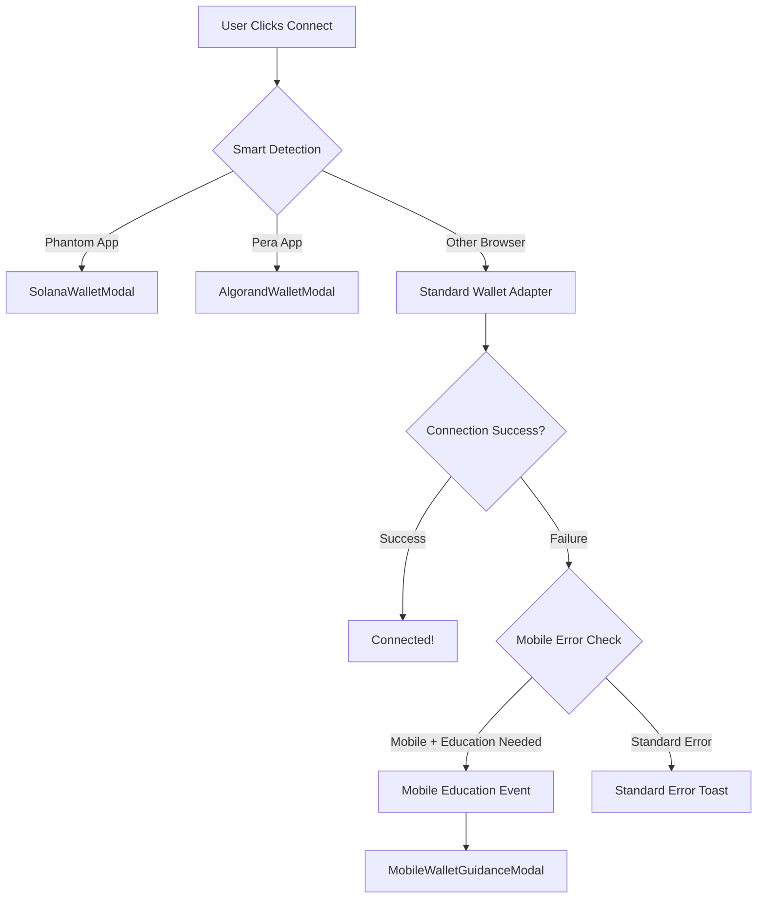

# 🎯 Hybrid Smart Wallet Modal + Mobile Education System - COMPLETE

## 🔄 **Implementation Summary**

Successfully implemented **Option A: Hybrid Approach** that combines the best of both systems:

1. **Smart Detection** for wallet app browsers (direct connection)
2. **Education System** for mobile browsers (try-first, educate-on-failure)

---

## 📋 **What We Built**

### **1. Smart Detection Layer**
- **Phantom App Browser** → `SolanaWalletModal` (direct Phantom connection)
- **Pera App Browser** → `AlgorandWalletModal` (direct Pera connection)  
- **Other Browsers** → Standard wallet adapter → Education system on failure

### **2. Education Integration**
- **Global Event System** (`mobile-education-events.ts`) for triggering education
- **Wallet Provider Integration** for catching adapter errors
- **Mobile Detection** using existing education system utilities
- **Automatic Fallback** from failed connections to education modals

### **3. Seamless UX Flow**

**Wallet App Users** (Perfect Experience):
```
User clicks connect → Smart detection → Direct wallet modal → Success!
```

**Mobile Browser Users** (Education Experience):
```
User clicks connect → Tries standard connection → Fails → Education modal → Guidance to wallet app
```

**Desktop Users** (Standard Experience):
```
User clicks connect → Standard wallet adapter → Success or standard error handling
```

---

## 🔧 **Technical Architecture**

### **Core Components**

1. **`SmartWalletModal.tsx`** - Smart router with context detection
2. **`SolanaWalletModal.tsx`** - Dedicated Phantom wallet interface  
3. **`AlgorandWalletModal.tsx`** - Dedicated Pera wallet interface
4. **`mobile-education-events.ts`** - Global event system for education triggers

### **Integration Points**

1. **`WalletProvider.tsx`** - Enhanced error handler with mobile education
2. **`Navbar.tsx`** - Event listener for mobile education triggers
3. **`SolanaWalletErrorHandler.tsx`** - Mobile education integration
4. **`mobile-wallet-detection.ts`** - Existing education utilities (preserved)

### **Event Flow**



---

## 🎯 **Key Benefits**

### **✅ Respects User Intent**
- Never assumes failure upfront
- Tries connection first, educates only when needed
- Perfect experience for wallet app users

### **✅ Smart Context Awareness**
- Auto-detects user's current environment
- Shows appropriate interface for each context
- No confusing manual wallet selection

### **✅ Educational When Needed**
- Clear guidance for mobile users
- Step-by-step instructions for wallet app usage
- Deep links to open in appropriate wallet apps

### **✅ Maintains Existing Functionality**
- All existing education system preserved
- All existing wallet connections preserved
- All existing error handling preserved

---

## 🚀 **Usage Examples**

### **Scenario 1: Phantom App User**
```typescript
// User opens snarbles.com in Phantom app
isPhantomAppBrowser() // → true
// Shows SolanaWalletModal with direct Phantom connection
```

### **Scenario 2: Mobile Safari User**
```typescript
// User tries to connect on mobile browser
isMobileDevice() // → true
needsWalletAppGuidance('solana') // → true
// Tries standard connection → Fails → Shows education modal
```

### **Scenario 3: Desktop Chrome User**
```typescript
// User on desktop with wallet extension
isMobileDevice() // → false
// Shows standard wallet adapter → Works normally
```

---

## 🔗 **Integration Status**

### **✅ Completed**
- [x] Smart detection logic implemented
- [x] Dedicated wallet modals created
- [x] Global education event system
- [x] Wallet provider error integration
- [x] Navbar event listener integration
- [x] TypeScript compilation verified
- [x] All existing functionality preserved

### **🎯 Ready for Testing**
- User experience testing on different devices
- Wallet app browser testing
- Mobile browser education flow testing
- Error handling edge case testing

---

## 📱 **Testing Scenarios**

### **Test on Phantom App**
1. Open Phantom mobile app
2. Navigate to snarbles.com in app browser
3. Click connect → Should show SolanaWalletModal directly

### **Test on Mobile Safari**
1. Open snarbles.com in mobile Safari
2. Click connect → Standard wallet modal appears
3. Connection fails → Education modal should appear automatically

### **Test on Desktop**
1. Open snarbles.com in desktop browser
2. Click connect → Standard wallet adapter behavior
3. Success or standard error handling

---

## 🎉 **Mission Accomplished**

**The hybrid system successfully:**
- ✅ Eliminates confusing tab-based wallet selection
- ✅ Provides perfect experience for wallet app users  
- ✅ Educates mobile users only when connection fails
- ✅ Maintains all existing functionality
- ✅ Respects user intent by trying connection first
- ✅ Uses smart context detection for optimal UX

**Result**: A seamless, intelligent wallet connection system that adapts to each user's context while preserving the educational benefits of the existing system. 🚀
