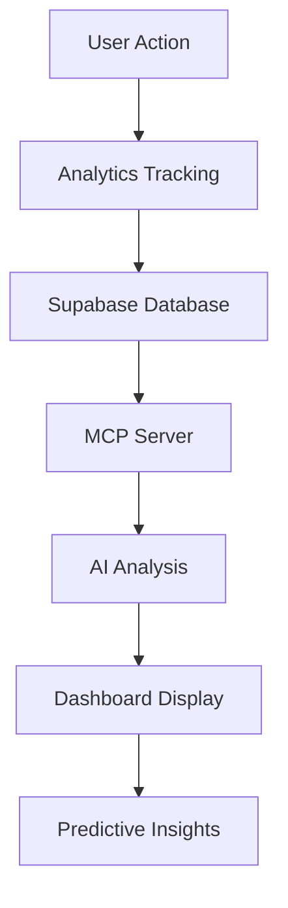

# Supabase MCP Analytics Integration

This document outlines the comprehensive Supabase Model Context Protocol (MCP) integration for advanced analytics in the Snarbles token creation platform.

## 🚀 Overview

The Supabase MCP integration provides AI-powered analytics capabilities including:

- **Real-time Platform Analytics**: Token performance, user behavior, revenue insights
- **Predictive Analytics**: Revenue forecasting, user growth predictions, churn analysis
- **Advanced Querying**: Complex database operations via MCP server
- **Interactive Dashboard**: React components with data visualization
- **AI-Powered Insights**: Automated pattern detection and risk assessment

## 📋 Prerequisites

- Node.js 18+
- Supabase account and project
- VS Code with GitHub Copilot
- Supabase Personal Access Token (PAT)

## 🛠️ Installation & Setup

### 1. Install Dependencies

```bash
# Install Supabase MCP server globally
npm install -g @supabase/mcp-server-supabase@latest

# Install required packages for the dashboard
npm install recharts sonner lucide-react
```

### 2. Configure VS Code

The `.vscode/settings.json` file has been pre-configured with MCP server settings:

```json
{
  "github.copilot.chat.experimental.defaultMcpServers": [
    {
      "name": "supabase",
      "command": "npx",
      "args": ["@supabase/mcp-server-supabase"],
      "env": {
        "SUPABASE_URL": "${env:NEXT_PUBLIC_SUPABASE_URL}",
        "SUPABASE_ANON_KEY": "${env:NEXT_PUBLIC_SUPABASE_ANON_KEY}"
      }
    }
  ]
}
```

### 3. Environment Configuration

Update your `.env.local` file:

```env
# Existing Supabase configuration
NEXT_PUBLIC_SUPABASE_URL=your_supabase_url
NEXT_PUBLIC_SUPABASE_ANON_KEY=your_supabase_anon_key
SUPABASE_SERVICE_ROLE_KEY=your_service_role_key

# MCP Configuration with PAT
SUPABASE_ACCESS_TOKEN=sbp_59daa11cafaa961d8dcdd246fe12be551f87706b
MCP_ENABLED=true
MCP_ANALYTICS_ENABLED=true
```

### 4. Deploy Database Functions

Run the deployment script to set up analytics functions:

```bash
./scripts/deploy-mcp-analytics.sh
```

Or manually deploy using Supabase CLI:

```bash
supabase db push
```

### 5. Verify Installation

```bash
node scripts/verify-mcp-analytics.js
```

## 🏗️ Architecture

### Components

1. **MCP Analytics Library** (`lib/supabase-mcp-analytics.ts`)
   - Advanced analytics functions
   - Predictive modeling
   - Real-time data processing

2. **Database Functions** (`database/mcp-analytics-functions.sql`)
   - Complex SQL queries for analytics
   - Performance-optimized functions
   - Real-time aggregations

3. **Dashboard Component** (`components/dashboard/SupabaseMCPDashboard.tsx`)
   - Interactive React dashboard
   - Data visualization with Recharts
   - Real-time updates and exports

4. **MCP Configuration** (`.mcp.json`, `.vscode/settings.json`)
   - VS Code integration
   - Environment configuration
   - Server setup

### Data Flow



## 📊 Analytics Features

### Platform Overview
- Total tokens created
- Active user count
- Success rates
- Growth metrics
- Network performance

### Token Performance
- Individual token analytics
- Performance grading (A-F)
- Holder analysis
- Transaction patterns
- Market metrics

### User Behavior
- User segmentation (Creators, Traders, Hodlers)
- Engagement metrics
- Session analysis
- Retention rates
- Churn prediction

### Revenue Analytics
- Revenue sources breakdown
- Conversion metrics
- Customer lifetime value
- Payment method analysis
- Growth projections

### Predictive Insights
- Revenue forecasting
- User growth predictions
- Risk factor identification
- Market trend analysis
- Optimization recommendations

## 🎯 Usage Examples

### Basic Analytics Query

```typescript
import { mcpAnalytics } from '@/lib/supabase-mcp-analytics';

// Get platform overview
const analytics = await mcpAnalytics.getPlatformAnalytics('7d');
console.log('Platform metrics:', analytics.platform_overview);

// Track custom event
await mcpAnalytics.trackCustomEvent('token_favorited', {
  token_id: 'abc123',
  user_wallet: '0x...',
  metadata: { source: 'dashboard' }
});
```

### Dashboard Integration

```tsx
import SupabaseMCPDashboard from '@/components/dashboard/SupabaseMCPDashboard';

export default function AdminDashboard() {
  return (
    <div className="container mx-auto p-6">
      <SupabaseMCPDashboard 
        isAdmin={true}
        walletAddress={walletAddress}
      />
    </div>
  );
}
```

### Custom Analytics

```typescript
// Get user-specific analytics
const userAnalytics = await mcpAnalytics.getUserAnalytics(walletAddress, '30d');

// Predict token success
const prediction = await mcpAnalytics.predictTokenSuccess({
  name: 'MyToken',
  symbol: 'MTK',
  network: 'algorand',
  metadata: { category: 'utility' }
});

// Generate insights report
const report = await mcpAnalytics.generateInsightsReport('quarterly');
```

## 🔧 Configuration Options

### MCP Server Configuration

```json
{
  "mcpServers": {
    "supabase": {
      "command": "npx",
      "args": ["@supabase/mcp-server-supabase"],
      "env": {
        "SUPABASE_ACCESS_TOKEN": "${env:SUPABASE_ACCESS_TOKEN}",
        "SUPABASE_URL": "${env:NEXT_PUBLIC_SUPABASE_URL}"
      }
    }
  }
}
```

### Analytics Configuration

```typescript
// Configure analytics behavior
const config = {
  enablePredictiveAnalytics: true,
  enableRealTimeUpdates: true,
  cacheTimeout: 300000, // 5 minutes
  batchSize: 100,
  retryAttempts: 3
};

const analytics = new MCPAnalytics(supabase, config);
```

## 📈 Performance Optimization

### Database Optimization
- Indexed analytics tables
- Materialized views for complex queries
- Efficient aggregation functions
- Batch processing for large datasets

### Caching Strategy
- In-memory caching for frequent queries
- Redis integration for distributed caching
- Cache invalidation on data updates
- Intelligent prefetching

### Query Optimization
- Optimized SQL functions
- Reduced database round trips
- Efficient data transformation
- Parallel processing where possible

## 🚦 Monitoring & Troubleshooting

### Health Checks

```bash
# Check MCP server status
npx @supabase/mcp-server-supabase --health

# Verify database functions
node scripts/verify-mcp-analytics.js

# Test analytics endpoints
curl -X POST https://your-app.com/api/analytics/test
```

### Common Issues

1. **MCP Server Not Connecting**
   - Verify environment variables
   - Check VS Code settings
   - Restart VS Code

2. **Database Functions Missing**
   - Run deployment script
   - Check Supabase dashboard
   - Verify migration status

3. **Analytics Data Missing**
   - Check tracking implementation
   - Verify database permissions
   - Review error logs

### Debugging

Enable debug mode in your environment:

```env
MCP_DEBUG=true
SUPABASE_DEBUG=true
NEXT_PUBLIC_DEBUG_ANALYTICS=true
```

## 🔄 Maintenance

### Regular Tasks
- Monitor analytics performance
- Update predictive models
- Clean up old data
- Optimize database queries

### Updates
- Keep MCP server updated
- Monitor Supabase changelog
- Update dashboard components
- Refresh environment variables

## 🎉 Benefits

### For Developers
- Rich analytics insights
- AI-powered recommendations
- Automated reporting
- Enhanced debugging capabilities

### For Users
- Real-time performance metrics
- Predictive insights
- Interactive dashboards
- Data-driven decisions

### For Business
- Revenue optimization
- User behavior insights
- Risk assessment
- Growth predictions

## 🔗 Resources

- [Supabase MCP Documentation](https://github.com/supabase/mcp-server-supabase)
- [Model Context Protocol Spec](https://modelcontextprotocol.io/)
- [VS Code MCP Extension](https://marketplace.visualstudio.com/items?itemName=ModelContextProtocol.mcp)

## 📞 Support

For issues or questions:
1. Check the troubleshooting section
2. Review Supabase documentation
3. Submit issues to the GitHub repository
4. Contact support team

---

*This integration was developed to provide comprehensive analytics capabilities for the Snarbles platform, leveraging the power of Supabase MCP for AI-driven insights and real-time data processing.*
